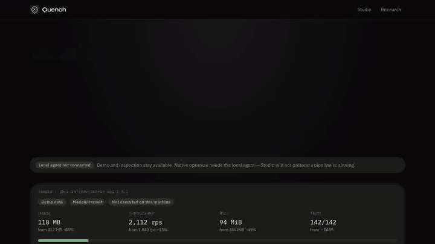

# Quench

  

**Local Linux x86_64 optimization pilot** for binaries and containers.

Quench measures a real baseline, applies conservative passes, runs the project’s existing tests and benchmarks, and keeps a candidate only when those gates pass. Commands and artifact hashes are recorded. Workload data stays on the machine that ran it.

[Live Studio](https://harrisontran2801.github.io/fjord-fire-dove-delta/studio/) · [Pilot guide](PILOT.md) · [Pilot checklist](PILOT_CHECKLIST.md) · [Setup](SETUP.md) · [Privacy](SETUP.md#inspection-privacy)

[Intro (WebM)](assets/quench-studio.webm) · [MP4](assets/quench-studio.mp4) · [Poster](assets/quench-studio-poster.png)

## Who this is for

SRE, platform, and systems teams that own a hot Linux x86_64 binary or container, already have tests and benches, and will not accept an optimizer that invents numbers.

## What is real vs demo

| In Studio | What it is |
| --- | --- |
| **Demo data / Modeled result** | Sample cards, including match-engine p99 **86 µs → 74 µs**. Product demonstration only. |
| **Inspection only** | ELF / Docker / OCI identified from file bytes. No optimizer, no fabricated benchmarks. Deleted after checking by default. |
| **Native agent** | Local Linux x86_64 run of `quench-agent optimize`. Real commands, hashes, and keep/reject gates. |

Public GitHub Pages is demo + inspection. Native optimize needs the local agent.

## What Quench does not claim

- Windows or macOS native optimize
- Cloud execution or a hosted SaaS
- Certified or ISO performance
- Savings or speedups before measurement
- Docker/OCI image rewrite (inspect only today)

Missing tools (`perf`, `llvm-bolt`, …) are reported **Unavailable**. A strip-only candidate is often **rejected** when it misses the improvement gate — that is the product working.

## Native pilots

On a Linux x86_64 host, start with [PILOT.md](PILOT.md) and tick [PILOT_CHECKLIST.md](PILOT_CHECKLIST.md). Bundled samples:

- [`samples/match-engine/quench.yaml`](samples/match-engine/quench.yaml) — small order-book sample. A native LBR run measured a median regression and was **rejected**.
- [`samples/opcode-vm/quench.yaml`](samples/opcode-vm/quench.yaml) — larger bytecode interpreter. Same 1% / 2% gates. It is a public technical sample, not a measured win, until a native run keeps the candidate.
